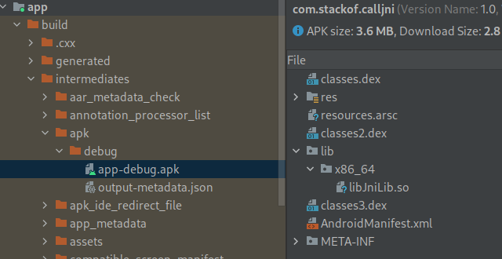

# 在apk中编译及调用so库

## 参考

https://www.cnblogs.com/andrewwang/p/11024891.html

https://cloud.tencent.com/developer/article/1446603   有图

主要参考这篇，但里面有些已经不适用新版本了。

## 前提

androidstudio,jdk,ndk都已经完成安装和配置

JDK>=11

## 创建项目

File-NewProject-EmptyActivity

Name:CallJni

PackageName:com.stackof.calljni

## 增加控件

### layout

ResourceManager-Layout-activity_main

默认已经有一个TextView，在Attributes-id中增加id textView1

新增一个按钮

id:button1

text:CallJni

onClick:bt1_click

### activity_main.xml

```java
<?xml version="1.0" encoding="utf-8"?>
<androidx.constraintlayout.widget.ConstraintLayout xmlns:android="http://schemas.android.com/apk/res/android"
    xmlns:app="http://schemas.android.com/apk/res-auto"
    xmlns:tools="http://schemas.android.com/tools"
    android:layout_width="match_parent"
    android:layout_height="match_parent"
    tools:context=".MainActivity">

    <TextView
        android:id="@+id/textView1"
        android:layout_width="wrap_content"
        android:layout_height="wrap_content"
        android:text="Hello World!"
        app:layout_constraintBottom_toBottomOf="parent"
        app:layout_constraintLeft_toLeftOf="parent"
        app:layout_constraintRight_toRightOf="parent"
        app:layout_constraintTop_toTopOf="parent" />

    <Button
        android:id="@+id/button1"
        android:layout_width="wrap_content"
        android:layout_height="wrap_content"
        android:onClick="bt1_click"
        android:text="Button"
        tools:layout_editor_absoluteX="162dp"
        tools:layout_editor_absoluteY="394dp"
        tools:ignore="MissingConstraints" />

</androidx.constraintlayout.widget.ConstraintLayout>
```

### MainActivity.java

```java
package com.stackof.calljni;

import androidx.appcompat.app.AppCompatActivity;

import android.os.Bundle;
import android.widget.TextView;
import android.view.View;

public class MainActivity extends AppCompatActivity {
    String Tag = "StackOF";
    TextView textview1;
    int c=0;
    @Override
    protected void onCreate(Bundle savedInstanceState) {
        super.onCreate(savedInstanceState);
        setContentView(R.layout.activity_main);
        textview1=(TextView)findViewById(R.id.textView1);
    }
    public void bt1_click(View view){
        c = c+1;
        textview1.setText("click:"+c+"\n"+JniLib.callToCpp());
    }
}
```

## JNI

app/src/main下新增jni目录

### External Tools

在File-Settings-Tools-External Tools新增

```
Name:javah
Program:$JDKPath$/bin/javac 
Arguments:-encoding utf8 -h $ProjectFileDir$/app/src/main/jni $FilePath$
Working direcory:$FileDir$
```


### JniLib.java

app/src/main/java/com.stackof.calljni下新增

```java
package com.stackof.calljni;

public class JniLib {
    static {
        System.loadLibrary("JniLib");
    }

    public static native String callToCpp();
}
```

### 自动生成com_stackof_calljni_JniLib.h

右键选择JniLib.java，选择External Tools-javah

会生成一个JnkLib.class，这个没用，可以删除，在jni目录生成

com_stackof_calljni_JniLib.h

```C
/* DO NOT EDIT THIS FILE - it is machine generated */
#include <jni.h>
/* Header for class com_stackof_calljni_JniLib */

#ifndef _Included_com_stackof_calljni_JniLib
#define _Included_com_stackof_calljni_JniLib
#ifdef __cplusplus
extern "C" {
#endif
/*
 * Class:     com_stackof_calljni_JniLib
 * Method:    callToCpp
 * Signature: ()Ljava/lang/String;
 */
JNIEXPORT jstring JNICALL Java_com_stackof_calljni_JniLib_callToCpp
  (JNIEnv *, jclass);

#ifdef __cplusplus
}
#endif
#endif
```

在jni下新增JniLib.cpp

```
#include "com_stackof_calljni_JniLib.h"

extern "C"
JNIEXPORT jstring JNICALL
Java_com_stackof_calljni_JniLib_callToCpp(JNIEnv *env, jclass clazz) {
    return (*env).NewStringUTF("从cpp返回的文本。");
}
```


## 编译及打包

jni目录下新增

### Application.mk

```
APP_ABI := all
```

### Android.mk

```
LOCAL_PATH := $(call my-dir)
include $(CLEAR_VARS)
LOCAL_MODULE := JniLib
LOCAL_SRC_FILES := JniLib.cpp
include $(BUILD_SHARED_LIBRARY)
```

app/build.gradle

在android一节中，defaultConfig之后、buildTypes之前增加如下代码：

    externalNativeBuild {
        ndkBuild {
            path "src/main/jni/Android.mk"
        }
    }

## 运行

有从cpp返回的文本，说明调用so成功了。


在apk中可以看到lib下有so文件


